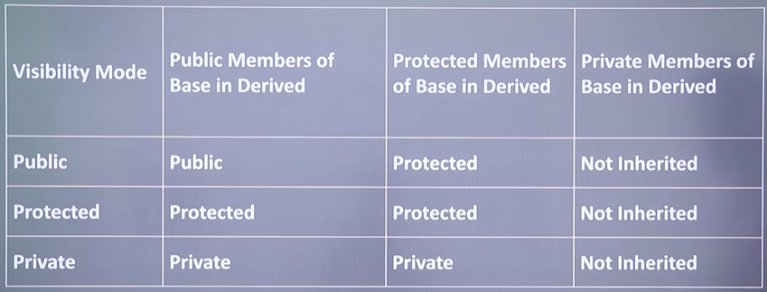

Inheritance is a mechanism in oops that allows one class(derieved/child) to
acquire the propertis & behaviours (data members & member functions)
 of another class(base/parent)

 Eg:

 class Base{
    //members of base class
 };

 class Derieved : vilibility_mode Base{
    //members of derieved class
 };

 benefit :

 reusebility

 